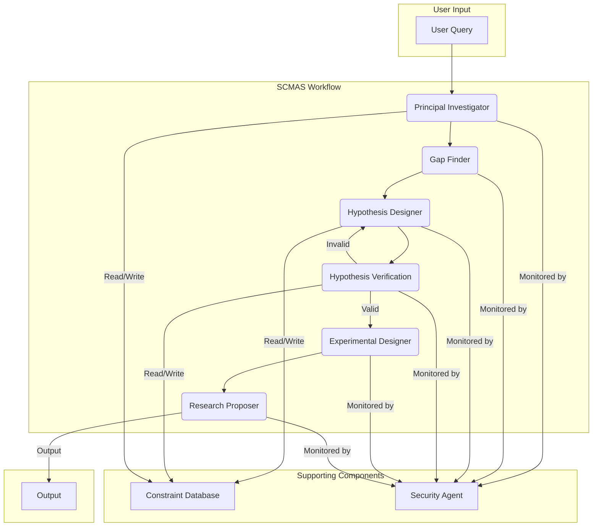

# 🌊 Marine Ecology Research Hypothesis Generator 🌊

> A Self-Correcting Multi-Agent System (SCMAS) for automated discovery of novel, testable, and scientifically constrained research hypotheses in marine ecology.

## 🚀 Project Overview

The goal of this project is to leverage synthesized literature and physical constraints to generate and validate research hypotheses. The system is designed to iteratively refine scientific ideas, from raw data to simulated experimental designs, ensuring that each step is grounded in scientific reality.

## ⚙️ System Architecture

The system is built as a multi-agent workflow orchestrated by a **Principal Investigator (PI)** agent. The workflow is designed to be self-correcting, with feedback loops for hypothesis verification and revision.



The overall workflow is as follows:

1.  **Principal Investigator** 🕵️‍♀️: Decomposes a user's query into research areas.
2.  **Gap Finder** 🗺️: Identifies research gaps in the existing literature.
3.  **Hypothesis Designer** ✍️: Proposes novel hypotheses based on the identified gaps.
4.  **Hypothesis Verification** 🔬: Checks the proposed hypotheses against a Constraint Database of known scientific facts.
5.  **Revision Loop** 🔄: If a hypothesis is invalid, it is sent back to the Hypothesis Designer for revision.
6.  **Experimental Designer** 🧪: Designs experiments to test validated hypotheses.
7.  **Security Agent** 🛡️: Monitors the entire process for policy violations.
8.  **Research Proposer** 📝: Summarizes the entire research plan.

## 🤖 Agents

The system is composed of the following agents:

*   **Principal Investigator (PI)**: Sets the research goals and manages the Constraint Database.
*   **Security Agent**: Enforces internal policies and prevents prompt injections.
*   **Gap Finder**: Analyzes research papers to identify gaps in the current body of knowledge.
*   **Hypothesis Designer**: Generates novel and falsifiable hypotheses.
*   **Hypothesis Verification**: Validates hypotheses against the Constraint Database.
*   **Experimental Designer**: Designs detailed lab and field experiments.
*   **Research Proposer**: Summarizes the complete research plan.

## 🛠️ Tools

The agents use the following tools:

*   `google_scholar_search`: Performs a simple keyword search on Google Scholar.
*   `advanced_google_scholar_search`: Performs an advanced search on Google Scholar with filters for author and year.
*   `query_constraint_database`: Queries the Constraint Database for scientific constraints.
*   `add_constraint_to_database`: Adds new constraints to the Constraint Database.

## 📚 Constraint Database

The Constraint Database is a key component of the system. It serves as a dynamic knowledge base of established physical laws, ecological limits, and experimental feasibility rules relevant to marine ecology. This database ensures that all generated hypotheses and experiments are scientifically plausible.

## 🏃‍♀️ Setup and Execution

The project is implemented as a workflow using the `google.adk` library. To run the workflow, you would typically execute the `root_agent` workflow defined in `agent.py`.

```python
# Example of how to run the workflow
from agent import root_agent

result = root_agent.run("Explore the impact of ocean acidification on coral bleaching.")
print(result)
```

## ✨ Examples

**Query:**

    Let's look for some unique ways to raise damselfish.

**Agent Response:**

    Narrative II: Bridging the Nutritional Gap in Larval Development
    Theme: Nutritional Synergy and Live-Feed Optimization
    
    Phase 1: The Context
    The larval stage of pomacentrids is the most precarious phase of their life cycle. Survival depends on a precise metabolic balance and the ability to transition from endogenous yolk sacs to exogenous feeding. This process occurs within tight environmental windows, typically between $26^\circ\text{C}–29^\circ\text{C}$ at depths of $10\text{m}–15\text{m}$ [ECO-TEMP-001, HAB-DEPTH-002], where planktonic productivity is highest.
    
    Phase 2: The Challenge
    The "weaning gap"—the transition from live rotifers to micro-encapsulated diets—is a primary point of failure in aquaculture. Larvae often struggle with the nutritional density and palatability of inert feeds, leading to stunted growth or "starvation-induced" mortality despite the presence of food. Existing protocols treat feeding and substrate as independent variables, ignoring the synergistic potential of the biological biofilm that naturally exists on reef surfaces.
    
    Phase 3: The Solution
    We propose a synergistic approach integrating a biomimetic biofilm-promoting substrate with a phased live-feed weaning protocol. We hypothesize that this combination will result in a $15%$ increase in larval growth rates by providing a supplementary, high-protein nutritional "safety net" via the biofilm.
    
    Experimental Path to Validation:
    
    Field Assessment: Using semi-permeable enclosures, larvae will be raised on biofilm-promoting substrates. Growth will be measured using a buoyant weighing system, providing a real-world benchmark for biomass accumulation in a natural nutrient regime.
    Laboratory Control: In a closed-circuit system, larvae will be split between a "synergized" group (biofilm substrate + phased weaning) and a control group (inert glass + standard weaning). ImageJ analysis via digital microscopy will be used to track precise changes in larval length and weight.
    Bioenergetic Simulation: A MATLAB-based bioenergetic model will calculate the metabolic cost of foraging versus the caloric gain from the biofilm. This will determine if the $15%$ growth target is robust across varying metabolic rates.
    Why pursue this? Solving the weaning gap would drastically increase the yield of larval rearing, making the sustainable aquaculture of pomacentrids commercially and scientifically viable.
    
    Narrative III: Dissolving Dominance through Fractal Complexity
    Theme: Territoriality Mitigation and Social Dynamics in High-Density Systems
    
    Phase 1: The Context
    In high-density environments, damselfish naturally organize into strict dominance hierarchies. In the wild, these hierarchies are moderated by the structural complexity of the reef, particularly the intricate branching of Acropora corals. These structures provide "visual refugia"—areas where subordinate fish can remain physically close to resources while remaining invisible to the dominant individual.
    
    Phase 2: The Challenge
    Captive high-density systems usually lack this specific type of structural complexity. When "line-of-sight" is unobstructed, dominant individuals can maintain constant surveillance over the entire territory. This leads to chronic stress in subordinates, manifested as elevated cortisol levels and significant growth disparities (where the dominant fish grows rapidly while others are stunted), eventually leading to systemic instability.
    
    Phase 3: The Solution
    We propose the introduction of additive-manufactured structural complexity utilizing fractal porosity that mimics Acropora architectures. The hypothesis is that increasing the ratio of "visual refugia" per individual will break the line-of-sight necessary for dominance maintenance, thereby flattening the social hierarchy.
    
    Experimental Path to Validation:
    
    Field Comparison: Using stereo-video photogrammetry, researchers will map the spatial distribution of fish in natural Acropora patches versus 3D-printed fractal mimics. The goal is to see if the "Gini coefficient" of territory size is similar in both environments.
    Laboratory Stress Analysis: Pomacentrus will be housed in high-density tanks with fractal refugia. The team will utilize water-borne cortisol assays and EthoVision XT tracking to prove that increased refugia access directly correlates with lower stress hormones and reduced aggression.
    Spatial Simulation: Using AnyLogic, a 3D simulation will calculate the "Line of Sight" (LoS) blockage probability. This will identify the mathematical "tipping point" of porosity where a dominance hierarchy collapses into a more egalitarian social structure.
    Why pursue this? This research offers a blueprint for "stress-free" high-density housing. By manipulating the geometry of the environment, we can bypass the biological imperative of aggression, allowing for healthier, more uniform growth in captive populations.

**Query:**

    What are some gaps in the research on 3D printed artificial reefs?

**Agent Response:**

    Narrative I: The Chemical Foundation of Growth
    Theme: Material Biocompatibility and Long-term Degradation
    
    Phase 1: The Context (Setting the Stage)
    Coral reefs are the architects of the ocean, yet their survival is increasingly dependent on human-engineered interventions. As we pivot toward 3D-printed restoration, the industry is caught between two philosophies: the use of biodegradable polymers like PLA—designed to disappear as the reef grows—and the use of permanent, carbon-sequestering concretes. However, the interface between a synthetic substrate and a living polyp is a site of intense chemical exchange. The foundational ecological reality is that coral calcification is exquisitely sensitive to the local chemical micro-environment; any leaching of monomers or heavy metals can trigger physiological stress, inhibiting the very growth the reef is meant to support (Valenzuela Matus et al., 2024; Albalawi et al., 2021).
    
    Phase 2: The Challenge (Defining the Gap)
    While current literature acknowledges that biodegradable materials are "eco-friendly" in a general sense, there is a critical lack of comparative data regarding the long-term physiological cost of these materials on adult colonies. We do not yet know if the "controlled leaching" of biodegradable polymers (Korniejenko et al., 2025) actually suppresses calcification rates when compared to the chemical stability of carbon-sequestering concretes. This gap prevents us from determining if the temporary nature of PLA is a benefit or a toxic liability for Acropora spp.
    
    Phase 3: The Solution (Proposing the Path)
    To resolve this, we propose Hypothesis 1: Carbon-sequestering concrete substrates exhibit significantly lower chemical leaching rates than PLA-based biodegradable polymers, resulting in a $\geq 20%$ increase in the calcification rates of adult Acropora spp. colonies.
    
    To test this, the researcher will employ a tri-layered experimental architecture:
    
    Field Validation (H1-FIELD): Deploy 120 Acropora fragments across 120 blocks (60 concrete, 60 PLA) at depths of 12m. Using buoyant weighing every 30 days, we will quantify net calcification ($\text{g cm}^{-2} \text{day}^{-1}$) to see if the concrete supports superior growth kinetics.
    Laboratory Mechanism (H1-LAB): Use ICP-MS to measure precise leaching rates of heavy metals and monomers over 14 days, while simultaneously monitoring the maximum quantum yield ($F_v/F_m$) of the corals via PAM fluorometry to link chemical leaching to physiological stress.
    Computational Prediction (H1-COMP): Utilize COMSOL Multiphysics to model the Fickian diffusion of leached chemicals within a 2mm boundary layer, creating a dose-response function that predicts calcification inhibition across 10,000 Monte Carlo iterations.
    Narrative II: The Architecture of Attraction
    Theme: Biomimetic Complexity and Targeted Recruitment
    
    Phase 1: The Context (Setting the Stage)
    The success of any artificial reef is not measured by the amount of life it attracts, but by the type of life it sustains. Natural reefs are defined by extreme structural complexity—fractal patterns that create varied flow regimes and refugia. In the race to restore these habitats, 3D printing allows us to move beyond simple blocks to complex biomimicry. However, the ocean is a competitive landscape; if a substrate is not specifically tuned to the needs of scleractinian larvae, it will be rapidly colonized by opportunistic macroalgae, effectively "locking out" the corals (Vieira et al., 2025).
    
    Phase 2: The Challenge (Defining the Gap)
    We possess the technology to print complex shapes, but we lack the "topological blueprint" for selectivity. The existing literature fails to define the exact threshold of structural complexity—specifically the fractal dimension—required to tip the balance of recruitment in favor of target corals over opportunistic algae. Without this precision, 3D printing remains an exercise in aesthetics rather than ecological engineering.
    
    Phase 3: The Solution (Proposing the Path)
    We propose Hypothesis 2: 3D-printed substrates utilizing biomimetic micro-topographies with a fractal dimension $\geq 2.6$ will recruit a higher ratio of target scleractinian larvae relative to opportunistic macroalgae compared to natural limestone substrates.
    
    The researcher will validate this through the following methodology:
    
    Field Validation (H2-FIELD): Deploy 100 tiles (50 with $D_f=2.65$, 50 natural limestone $D_f=2.10$) at 8m depth. Over 120 days, high-resolution DSLR imagery and stereomicroscopy will be used to calculate the recruitment ratio: $\text{Scleractinia} / \text{Macroalgae}$.
    Laboratory Mechanism (H2-LAB): In a recirculating flume tank, we will introduce Acropora larvae and use Laser Particle Image Velocimetry (PIV) to map how flow turbulence around fractal surfaces influences larval settlement preference.
    Computational Prediction (H2-COMP): Using ANSYS Fluent and Navier-Stokes equations, we will simulate the trajectory of 150$\mu\text{m}$ larvae across 500 different STL geometries to correlate the "Attachment Probability Index" with the fractal dimension $D_f$.
    Narrative III: The Engine of the Ecosystem
    Theme: Longitudinal Trophic Integration and Ecosystem Services
    
    Phase 1: The Context (Setting the Stage)
    A reef is more than a collection of corals; it is a biogeochemical engine. One of the most critical services this engine provides is nutrient cycling, specifically the conversion of nitrate ($\text{NO}_3^-$) to nitrogen gas ($\text{N}_2$) through denitrification. This process prevents eutrophication and maintains the oligotrophic conditions necessary for coral health. The transition from a bare synthetic surface to a functioning ecosystem depends entirely on the microbial biofilm that first colonizes the substrate (Gimblett et al., 2026).
    
    Phase 2: The Challenge (Defining the Gap)
    Most artificial reef research focuses on the "colonization phase"—who arrives first. There is a profound gap in our understanding of the "integration phase"—how the substrate material influences the long-term stability of the nitrogen cycle. We do not know if carbon-sequestering concretes, with their specific porosity and alkalinity, foster a more efficient denitrification community than traditional polymers over a multi-year horizon.
    
    Phase 3: The Solution (Proposing the Path)
    We propose Hypothesis 3: The transition from initial microbial colonization to a stable community structure on carbon-sequestering concrete reefs increases the local benthic nitrogen cycling efficiency (measured via $\text{NO}_3^-$ to $\text{N}_2$ conversion) compared to traditional polymer-based artificial reefs.
    
    The researcher will execute this investigation via:
    
    Field Validation (H3-FIELD): Deploy 20 reefs (10 concrete, 10 polymer) and utilize in-situ benthic chambers every 60 days for one year. Isotope ratio mass spectrometry will measure the $\text{NO}_3^-$ to $\text{N}_2$ flux to quantify denitrification efficiency.
    Laboratory Mechanism (H3-LAB): Biofilm cores will be extracted and placed in anaerobic chambers amended with $^{15}\text{N}$-labeled $\text{KNO}_3$. Gas Chromatography (GC-IRMS) will be used to determine the exact rate of $^{15}\text{N}_2$ production.
    Computational Prediction (H3-COMP): A metabolic network model with 1,000 nodes (representing microbial guilds) will be built using Python/SciPy. By varying the "Substrate Porosity" parameter, the model will simulate the one-year transition from initial colonization to a stable nutrient-cycling state.

## Known Bugs
- When the agent is used too frequently, the Google Scholar search tool hits a rate limit and returns an empty set, causing the Gap Finder to loop infinitely. 
